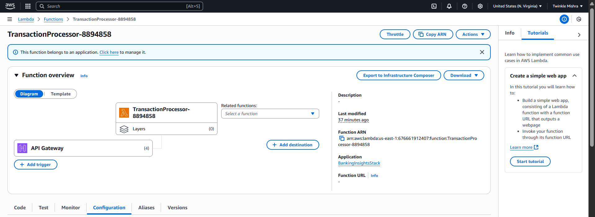
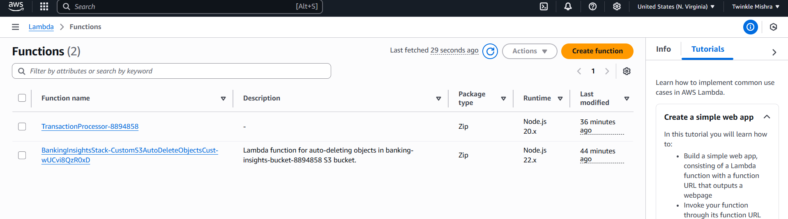
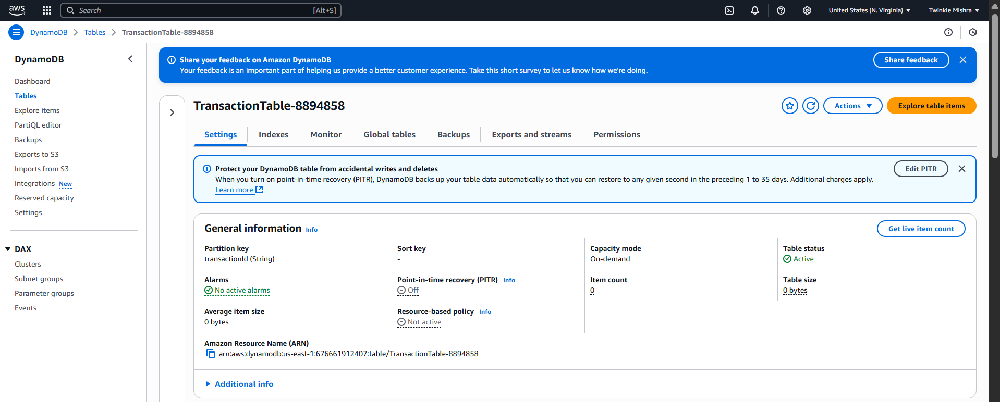
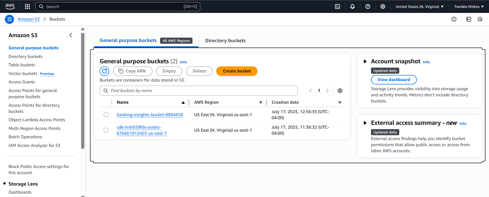
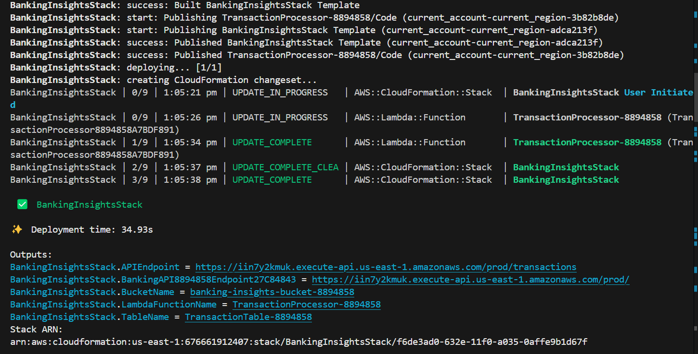
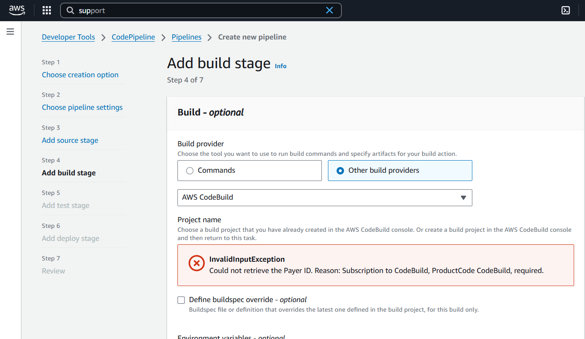
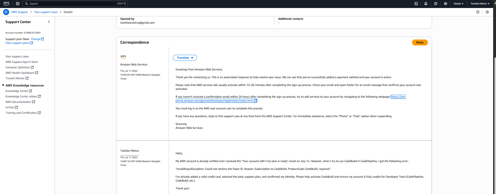
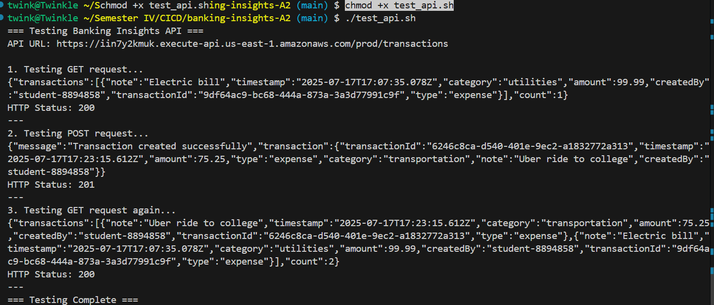

# Assignment 2 - CI/CD with AWS CDK and CodePipeline  
**Student Name**: Twinkle Mishra  
**Student ID**: 8894858

---

## Objective

This project demonstrates how to provision and deploy a serverless architecture using AWS CDK and automate it using GitHub Actions. Although CodePipeline was the intended CI/CD tool, it could not be used due to account limitations, so GitHub Actions was implemented as a working alternative.

---

## Stack Overview

- **Language**: TypeScript (AWS CDK)
- **Infrastructure as Code**: AWS CDK
- **CI/CD**: GitHub Actions
- **AWS Services Used**:
  - AWS Lambda (Node.js)
  - DynamoDB
  - API Gateway
  - S3 (for storing build artifacts)
  - CloudFormation

---

## Application Architecture

A Lambda-based API that allows storing and retrieving transaction data:

- `TransactionProcessor`: Lambda function written in Node.js.
- `TransactionsTable`: DynamoDB table for transaction records.
- `API Gateway`: REST endpoint integrated with Lambda.

**Diagram:**  


---

## Local Development & Deployment

### Prerequisites

- AWS CLI configured with credentials
- AWS CDK installed
- Node.js & NPM

### Steps

1. Install dependencies

```bash
npm install -g aws-cdk
npm install
```

2. Bootstrap your environment (only once)

```bash
cdk bootstrap
```

3. Deploy the CDK stack

```bash
cdk deploy
```

**Screenshots:**  
- Lambda Function:  
  
- DynamoDB Table:  
  
- S3 Bucket:  
  

---

## CI/CD via GitHub Actions

Since AWS CodeBuild and CodePipeline could not be activated (explained below), we used GitHub Actions for deployment automation.

### Secrets Setup

- Go to GitHub > Settings > Secrets and variables > Actions
- Add the following secrets:
  - `AWS_ACCESS_KEY_ID`
  - `AWS_SECRET_ACCESS_KEY`

**Screenshot:**  


### Workflow Logic

File: `.github/workflows/deploy.yml`  
Triggered on every push to `main` branch.

Steps:
1. Install dependencies
2. Bootstrap CDK
3. Deploy the stack

**Screenshot:**  


---

## Why CodePipeline Could Not Be Used

Despite the AWS account being verified, trying to use CodeBuild inside CodePipeline produced this error:

```
InvalidInputException: Could not retrieve the Payer ID.
Reason: Subscription to CodeBuild, ProductCode CodeBuild, required.
```

**Screenshot:**  


A support ticket was opened to AWS:  


GitHub Actions was used instead.

---

## Deployment Success

The GitHub Actions successfully deployed the CDK stack. Below is the confirmation and sample test:

**Screenshot:**  


Sample command to test:

```bash
curl -X POST https://your-api.execute-api.us-east-1.amazonaws.com/prod/transactions   -H "Content-Type: application/json"   -d '{"id": "001", "amount": 100, "type": "deposit"}'
```

---

## GitHub Repo

[View on GitHub](https://github.com/TwinkleM97/Assignment2-CI-CD)
