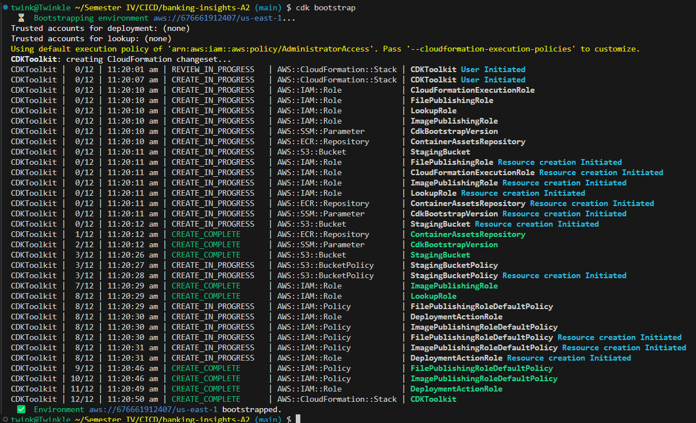
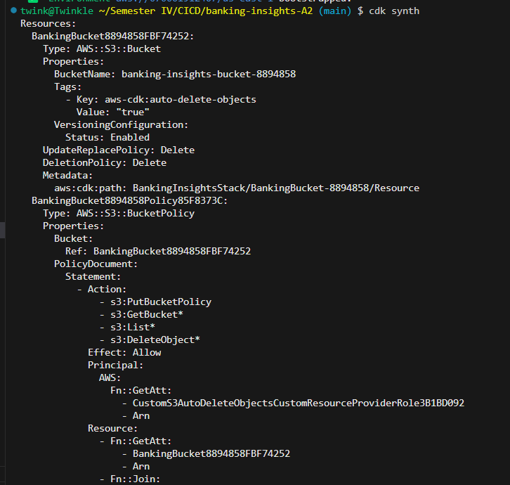
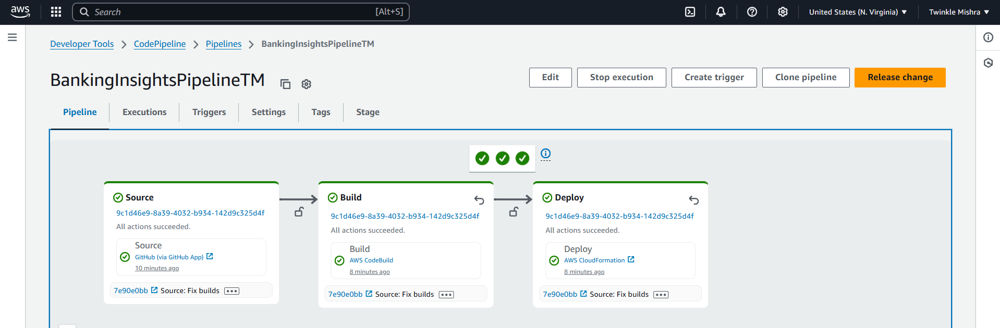
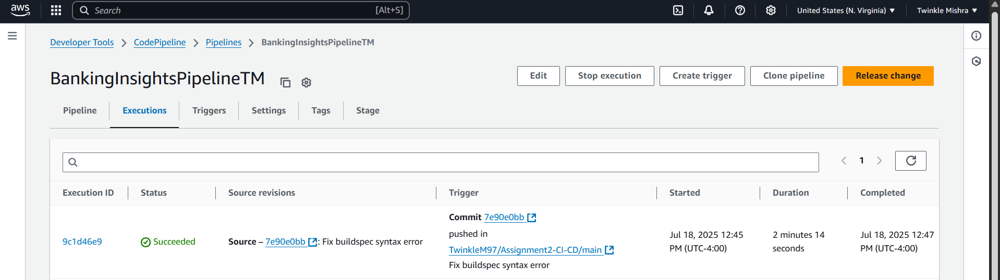
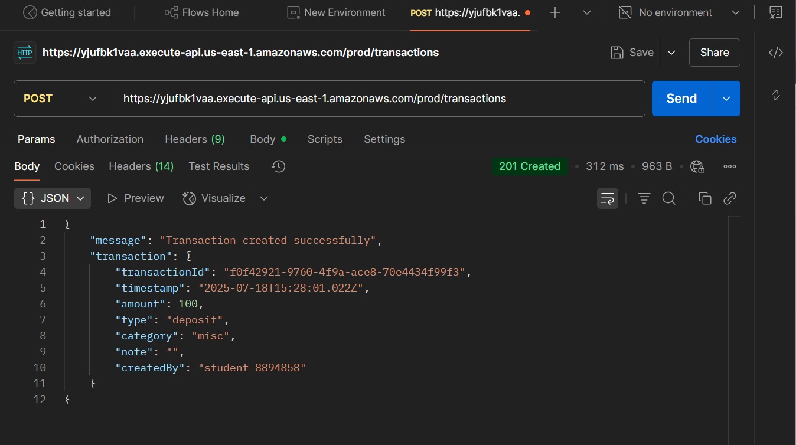
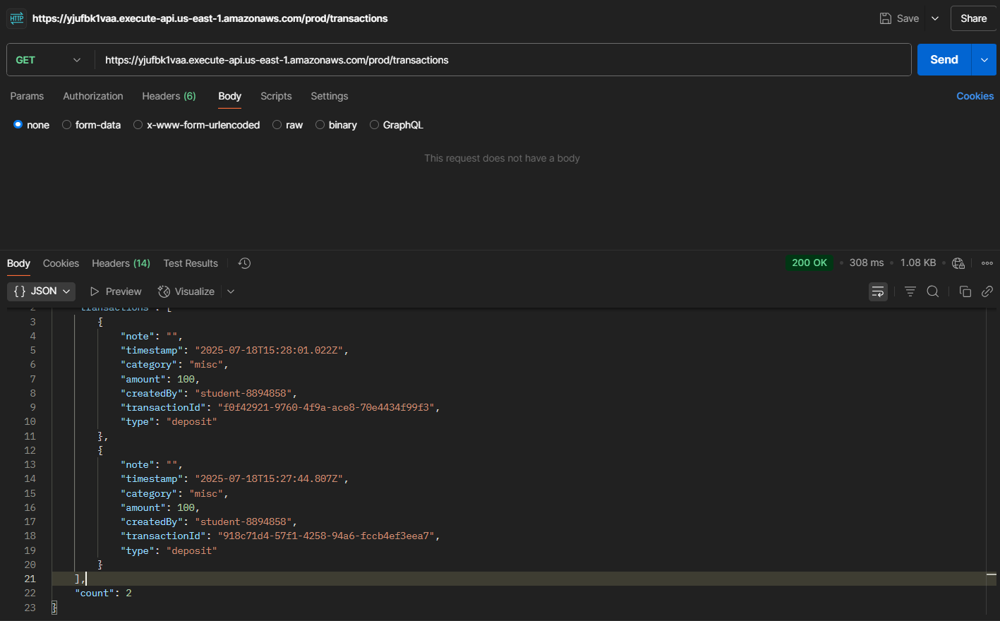

# Banking Insights CI/CD Pipeline - Assignment 2

**Name:** Twinkle Mishra  
**Student ID:** 8894858  

## Objective

This project demonstrates how to use the AWS Cloud Development Kit (CDK) with AWS CodePipeline to deploy cloud infrastructure following Infrastructure as Code (IaC) principles.

The solution includes:
- An **S3 bucket** to store static artifacts.
- A **Lambda function** for processing transactions.
- A **DynamoDB table** to persist data.
- A **CI/CD pipeline** using CodePipeline with GitHub integration, CodeBuild, and CloudFormation deployment.

---

## Project Structure

```bash
BANKING-INSIGHTS-A2/
│
├── bin/
│   └── banking-insights.ts      # Bootstraps & launches CDK app
│  
├── lambda/                      # Lambda function code
│   └── processTransactions.js
│
├── lib/
│   └── banking-insights-stack.ts  # CDK Stack Definition
│
├── screenshots/                # Screenshots for documentation
│
├── buildspec.yml               # CodeBuild configuration
├── README.md                   # Project documentation
├── test_api.sh                 # Script to test deployed API
└── debug.sh                    # Helper for local testing
```
---
## Technologies Used  
- **AWS CDK (TypeScript)**
- **Amazon S3**
- **AWS Lambda**
- **Amazon DynamoDB**
- **API Gateway**
- **AWS CodePipeline + CodeBuild**
- **GitHub (Source)**
- **Postman** for API testing
---

## Resources Created

### CDK Bootstrap
CDK environment initialized using `cdk bootstrap`.



### CDK Synth Output
Synthesized CloudFormation templates using `cdk synth`.



### CDK Deploy Success
Stack deployed using `cdk deploy`.


### S3 Bucket Created
An S3 bucket for storing data was created.


### Lambda Function Created
The transaction processing Lambda function was created.


### DynamoDB Table Created
A DynamoDB table was provisioned for storing transaction data.


---

## CI/CD Pipeline

### Pipeline Execution (Source → Build → Deploy)
AWS CodePipeline successfully pulled from GitHub, built via CodeBuild, and deployed using CloudFormation.




---

## API Gateway Testing

### POST Transaction to API
Tested POST API using Postman or curl.



### GET Transactions from API
Validated GET endpoint response.



---

## Manual Testing with Script
Executed `test_api.sh` to automate testing of the `/transactions` endpoint.


---

## Architecture Diagram
Visual overview of deployed infrastructure.


---

## Summary

- Developed CDK project in TypeScript to provision S3, Lambda, and DynamoDB.
- Bootstrapped and deployed infrastructure using `cdk deploy`.
- Integrated GitHub repo with CodePipeline.
- Defined build process using `buildspec.yml`.
- Validated endpoints manually and via shell scripts.
- Documented using screenshots for evaluation.

---
